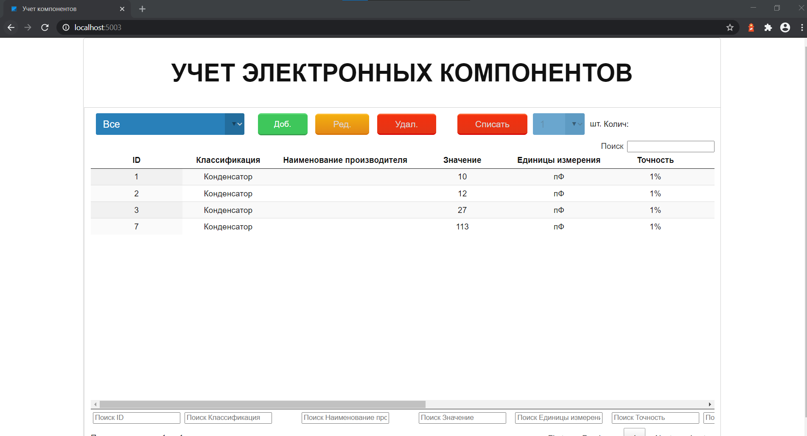

# ComponentDB
WEB приложение для учета электронных компонентов



## Установка необходимых компонентов

### Установка python
https://www.python.org
### Установка модулей для работы с базой данных mySQL
```
pip install peewee
pip install cryptography
pip install PyMySQL
```

### Установка модулей для WEB приложения

```
pip install flask
pip install cherrypy
```
### Установка mysql сервера
Инструкция на сайте: https://www.mysql.com

## Подготовка базы данных
### Создание БД
Запуск консоли mysql:
```
mysql -u root -p
```
Далее необходимо ввести пароль, который был указан при установке mysql.

Создается база:
```
CREATE DATABASE db_name;
```
Создание пользователя и привилегий для использования БД:
```
GRANT ALL PRIVILEGES ON db_name.* TO 'user_name'@'localhost' IDENTIFIED BY 'password';
FLUSH PRIVILEGES;
```
Выход
```
exit
```

### Настройки после создания БД
Для указанных настроек БД соответствтующий раздел файла config.py будет выглядеть так:
```
#----Database settings----#
# Host for mySQL database
DB_HOST = "localhost"
# User of database
DB_USER = "user_name"
# Name of database
DB_NAME = "db_name"
# Password for database
DB_PSWD = "password"

```

## Запуск приложения
Команда:
```
python run.py
```
После первого запуска приложение создаст файл config.py и закроется. После задания настроек необходимо еще раз запустить приложение.
## Создание сервися linux

В папке /etc/sytemd/system/ создается файл с расширением .service
Например components.service:
```
[Unit]
Description=components # Service name

[Service]
ExecStart=/home/orangepi/ComponentDB/run.py # Path to run.py file

[Install]
WantedBy=multi-user.target
```
Далее управление сервисом осуществляется командой systemctl.
Примеры:
```
systemctl enable components # Разрешить запуск сервиса при старте системы
systemctl disable components # Запретить запуск сервиса при старте системы
systemctl start components # Запуск сервиса
systemctl stop components # Остановка сервиса
```
## Создание бэкапа БД
Для создания резервной копии БД необходимо выполнить скрипт dump.py:
```
python dump.py
```
Путь для сохранения файла резервной копии указывается в файле config.py:

```
#-----Backup settings-----#
# Using relative path
RELATIVE_PATH = True
# Path for saving dump
DUMP_PATH = "/dump/dump.sql"
```

Флаг RELATIVE_PATH указывает использовать каталог относительно папки проекта (True) или абсолютный путь (False).